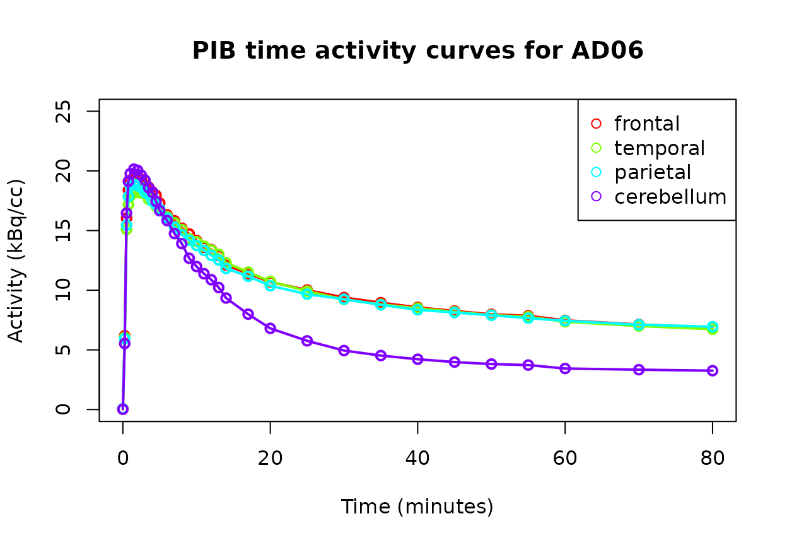
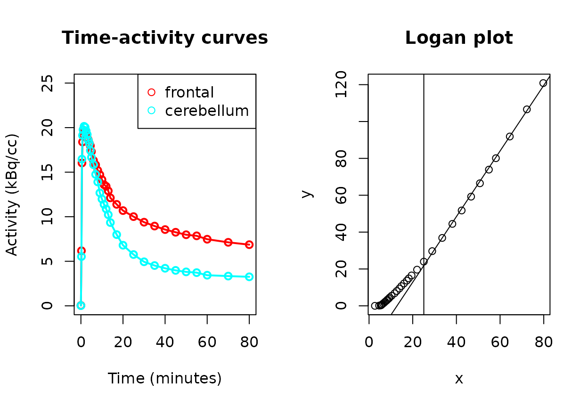

# Analysis with tacmagic

## Background

[Positron emission
tomography](https://en.wikipedia.org/wiki/Positron_emission_tomography)
(PET) is a research and clinical imaging modality that uses radioactive
tracers that bind to target molecules of interest. A PET scanner
identifies the tracer location by virtue of the tracer’s radioactive
decay, providing information to determine the location of the target in
the body. As the spatial resolution of PET is relatively poor, analysis
is frequently combined with higher resolution imaging such as magnetic
resonance imaging (MRI), which can be spatially co-registered to the PET
image. Subsequently, radiotracer activity (over time) can be identified
by spatial region of interest (ROI).

An image analysis pipeline is required to extract regional time activity
curves (TACs) from a dynamic PET image. There are various pipelines
available including widely-used commercial solutions
(e.g. [PMOD](https://www.pmod.com/web/)) and newer open-source options
(e.g. magia[^1]). Pipelines generally implement the following steps:

- Dynamic PET pre-processing (e.g. motion correction, decay-correction)
- PET image co-registration with structural MRI
- MRI segmentation and normalization to atlas

Various pipelines save TAC, volume and related data in various formats.
This package enables the loading and analysis of TAC and ROI volume data
from image analysis pipelines for further analysis in R.

## Vignette data

The sample data for this vignette uses an anonymized scans of a
participant with Alzheimer’s dementia, data from <http://www.gaain.org>
which was generously made available for unrestricted use.[^2] The
radiotracer used is Pittsburgh Compound B (PIB) which binds to
beta-amyloid, a protein found in high concentration in the brains of
individuals with Alzheimer’s dementia.

There are two approaches to using the **tacmagic** package to analyze
PET time-activity curve data: either by loading participant data
individually and using the various functions to analyze it, or via the
batch functions to list and analyze data from multiple participants.
Here, we illustrate the main features of tacmagic, by walking through
the analysis of a single participant. We provide an explanation of the
batch mode at the end.

## Time-activity curve operations

### Data loading

Time-activity curve (TAC) data is loaded via
[`load_tac()`](https://docs.ropensci.org/tacmagic/reference/load_tac.md),
which is a wrapper for format-specific functions. To specify which file
format the TAC data is stored as, use the `format` parameter. Supported
formats can be viewed in
[`help(load_tac)`](https://docs.ropensci.org/tacmagic/reference/load_tac.md).

The minimal amount of information required is the TAC data for one or
more ROI, including the start and stop times of each frame, the time
units and the activity units. This information may be in 1 or more files
depending on the format and software that created it.

For example, PMOD’s `.tac` files contain all of the information, but the
TAC .voistat files do not contain start and stop times, but this
information could be specified using a `.acqtimes` file. Support is also
available for DFT format, which contains both TAC and volume data.

We processed the PIB PET and T1 MRI data with the **PMOD PNEURO**
software suite to produce a `.tac` file with TACs for all ROIs in the
Hammer’s atlas. The `.tac` file can be loaded with
[`load_tac()`](https://docs.ropensci.org/tacmagic/reference/load_tac.md):

``` r

# Filename is a character string of the file's path on your computer.
filename <- system.file("extdata", "AD06.tac", package="tacmagic")
# Note: This file can also serve as a template if the TAC data is in some other 
# format that is not yet supported.

AD06_tac <- load_tac(filename, format="PMOD")
```

A TAC object is a data frame with extra attributes including time and
activity units. A summary can be printed with the generic
[`print()`](https://rdrr.io/r/base/print.html) function.

``` r

summary(AD06_tac) 
#> tac object
#>  Activity unit:           kBq/cc 
#>  Time unit:               seconds 
#>  Number of ROIs:          172 
#>  Number of frames:        34 
#>  Time span:               0 - 5400 seconds 
#>  Unique frame durations:  15 30 60 180 300 600 seconds

AD06_tac[1:5,1:5] # the first 5 frames of the first 3 ROIs
#>   start end FL_mid_fr_G_l FL_mid_fr_G_r FL_precen_G_l
#> 1     0  15    0.05156934     0.0830544   -0.05035268
#> 2    15  30    5.76280770     5.9782509    6.15967912
#> 3    30  45   16.07137663    16.3756559   16.69802808
#> 4    45  60   19.11766922    19.4707593   18.52006408
#> 5    60  90   19.77191392    20.3383362   19.55189423
```

PMOD’s suite also produces `.voistat` and `.acqtimes` formats, than can
be used to produce the same data if you do not have `.tac` files:

``` r

filename_acq <- system.file("extdata", "AD06.acqtimes", package="tacmagic")
filename_voistat <- system.file("extdata", "AD06_TAC.voistat", package="tacmagic")

tac2 <- load_tac(filename_voistat, format="voistat", acqtimes=filename_acq)

all.equal(AD06_tac, tac2)
#> [1] TRUE
```

We also used Turku’s **magia** pipeline to process the same data. It can
be loaded similarly, though with units explicitly entered because the
information is not encoded in the .mat file:

``` r

f_magia <- system.file("extdata", "AD06_tac_magia.mat", package="tacmagic")

AD06_tac_magia <- load_tac(f_magia, format="magia", 
                           time_unit="seconds", activity_unit="kBq/cc")

AD06_tac_magia[1:5,1:5]
#>   start end        CGA         CGP          LOC
#> 1     0  15  0.2070033  0.04986614 -0.001164075
#> 2    15  30  7.8729520  7.12711797  6.058719929
#> 3    30  45 16.6898445 17.37585231 18.097222061
#> 4    45  60 17.7306580 19.33122997 21.146157237
#> 5    60  90 18.9857118 19.57800502 22.009607171
```

#### Manually-created TAC objects

For other data sources, **tacmagic** TAC objects can be created from
data.frame objects with
[`as.tac()`](https://docs.ropensci.org/tacmagic/reference/as.tac.md).
The time and activity units must be specified as arguments if not
already set as attributes in the data.frame. The columns of the
data.frame are the regional TACs, with the column names the names of the
ROIs.

``` r

manual <- data.frame(start=c(0:4), end=c(2:6), ROI1=c(10.1:14.2), ROI2=c(11:15))
manual_tac <- as.tac(manual, time_unit="minutes", activity_unit="kBq/cc")

summary(manual_tac)
#> tac object
#>  Activity unit:           kBq/cc 
#>  Time unit:               minutes 
#>  Number of ROIs:          2 
#>  Number of frames:        5 
#>  Time span:               0 - 6 minutes 
#>  Unique frame durations:  2 minutes
```

### Radioactivity unit conversion

Most modern PET tools use kBq/cc as the standard activity units required
by the software (e.g. TPCCLIB, PMOD). Most often data will be in this
format and not require conversion. However, conversion of TAC objects to
these units, or to other radioactivity units for that matter, is
possible with
[`change_units()`](https://docs.ropensci.org/tacmagic/reference/change_units.md).
This is a generic function that works on `tac` objects as well as
`numeric` objects. For `numeric` objects, both “to” and “from” units
need to be specified. The function works regardless of whether the units
are per volume (i.e. kBq is treated the same was as kBq/cc or kBq/mL).

``` r

change_units(5, to_unit = "kBq", from_unit = "nCi")
#> [1] 0.185
change_units(0.5, to_unit = "nCi/cc", from_unit = "kBq/cc")
#> [1] 13.51351
```

With `tac` objects, as the activity units are stored in the object, they
should not be provided to
[`change_units()`](https://docs.ropensci.org/tacmagic/reference/change_units.md):

``` r

AD06_nCi <- change_units(AD06_tac, to_unit = "nCi/cc")
summary(AD06_nCi)
#> tac object
#>  Activity unit:           nCi/cc 
#>  Time unit:               seconds 
#>  Number of ROIs:          172 
#>  Number of frames:        34 
#>  Time span:               0 - 5400 seconds 
#>  Unique frame durations:  15 30 60 180 300 600 seconds
```

### ROI merging

Often it is desirable to combine TAC ROIs into larger ROIs. For example,
if the PET analysis pipeline created TACs for each atlas ROI, your
analysis may call for merging these atomic ROIs into larger regions,
such as merging all of the atlas ROIs that make up the frontal lobe into
a single frontal lobe ROI.

If this is done, the means should be weighted for the relative volumes
of the atomic ROIs. If volume information is available,
[`tac_roi()`](https://docs.ropensci.org/tacmagic/reference/tac_roi.md)
provides this functionality.

In PMOD’s software, volume information is available in `.voistat` files.
Units do not matter because it is the relative volume information that
is needed.

In addition to TAC and volume information, we must specify which atomic
ROIs make up the merged ROI. This is done by providing a named list,
where the names are the merged ROIs and the list items are themselves
lists of the atomic ROIs that make up each merged ROI. For the Hammer’s
atlas, and as an example, typical data is provided in
[`roi_ham_stand()`](https://docs.ropensci.org/tacmagic/reference/roi_ham_stand.md),
[`roi_ham_full()`](https://docs.ropensci.org/tacmagic/reference/roi_ham_full.md),
or
[`roi_ham_pib()`](https://docs.ropensci.org/tacmagic/reference/roi_ham_pib.md).

``` r

AD06_volume <- load_vol(filename_voistat, format="voistat")

roi_ham_pib()[1:2] # The first 2 definitions of merged ROIs, as an example.
#> $leftfrontal
#>  [1] "FL_mid_fr_G_l"       "FL_precen_G_l"       "FL_strai_G_l"       
#>  [4] "FL_OFC_AOG_l"        "FL_inf_fr_G_l"       "FL_sup_fr_G_l"      
#>  [7] "FL_OFC_MOG_l"        "FL_OFC_LOG_l"        "FL_OFC_POG_l"       
#> [10] "Subgen_antCing_l"    "Subcall_area_l"      "Presubgen_antCing_l"
#> 
#> $rightfrontal
#>  [1] "FL_mid_fr_G_r"       "FL_precen_G_r"       "FL_strai_G_r"       
#>  [4] "FL_OFC_AOG_r"        "FL_inf_fr_G_r"       "FL_sup_fr_G_r"      
#>  [7] "FL_OFC_MOG_r"        "FL_OFC_LOG_r"        "FL_OFC_POG_r"       
#> [10] "Subgen_antCing_r"    "Subcall_area_r"      "Presubgen_antCing_r"

AD06 <- tac_roi(tac=AD06_tac,           # The TAC file we loaded above.
                volumes=AD06_volume,    # Volume information loaded.
                ROI_def=roi_ham_pib(),  # ROI definitions for the Hammers atlas
                merge=F,                # T to also return atomic ROIs
                PVC=F                   # to use _C ROIs (PMOD convention)            
                )

AD06[1:5,1:5]
#>   start end leftfrontal rightfrontal lefttemporal
#> 1     0  15  0.02912641   0.05734614    0.0612965
#> 2    15  30  6.12655470   6.23215512    6.3573101
#> 3    30  45 16.06737144  16.00035525   15.4122525
#> 4    45  60 18.31769407  18.45778499   17.3612789
#> 5    60  90 19.24138550  19.18263937   17.9358282
```

### Plotting

Basic TAC plotting can be done by calling `plot`, which accepts two TAC
objects, e.g. from 2 participants or group means. The ROIs to plot are
specified as a vector of ROI names as they appear in the TAC object. As
the TAC object contains time unit information, the plot can convert to
desired units, which can be specified with the `time` argument.

``` r

plot(AD06,                                                    # TAC data
     ROIs=c("frontal", "temporal", "parietal", "cerebellum"), # ROIs to plot
     time="minutes",                   # Convert x axis from seconds to minutes
     title="PIB time activity curves for AD06"        # A title for the plot
     )
```



## Model calculation

### Standardized uptake value (SUV)

As the activity in the TAC is impacted by the dose of the radiotracer
administered and the participant’s body weight, a value adjusted for
these factors is sometimes used, the
[SUV](http://www.turkupetcentre.net/petanalysis/model_suv.md):

``` math
SUV = \frac{Ct}{\frac{Dose}{Weight}}
```

Where activity is measured in *kBq/mL (kBq/cc)*, the dose is in *MBq*,
and the weight is in *kg*, the radioactivity units cancel and the SUV
units are g/mL.

With the
[`tac_suv()`](https://docs.ropensci.org/tacmagic/reference/tac_suv.md)
function, a `tac` object can be converted to SUV values with units
*g/mL*, as demonstrated below (note the weight and dose are fabricated
here for the demonstration).

``` r

AD06_suv_tac <- tac_suv(AD06, dose = 8.5, dose_unit = "mCi", weight_kg = 70)
```

More often, an everage value over a certain time period, or a maximum
value may be desired. This can be calculated with the
[`suv()`](https://docs.ropensci.org/tacmagic/reference/suv.md) function.

``` r

AD06_suv_calc <- suv(AD06, SUV_def = c(3000, 3300, 3600), dose = 8.5, dose_unit = "mCi", weight_kg = 70)
AD06_suv_calc["frontal",]
#> [1] 1.713055
AD06_suv_max <- suv(AD06, SUV_def = "max", dose = 8.5, dose_unit = "mCi", weight_kg = 70)
AD06_suv_max["frontal",]
#> [1] 4.338809
```

### SUV ratio (SUVR)

The standardized uptake value ratio ($`SUVR`$) is a simple
quantification of PET activity that is commonly used from many tracers
including PIB. It is the ratio of the tracer activity over a specified
time period ($`Ct`$) in a target ROI to a reference region. Using a
ratio allows factors that are normally required to calculate an $`SUV`$
to cancel out, namely tracer dose and patient body weight, and therefore
$`SUVR`$ can be calculated from TAC data alone, i.e. without the need to
specify tracer dose or body weight:

``` math
SUVR = \frac{SUV_{TARGET}}{SUV_{REF}} = \frac{Ct_{TARGET}}{Ct_{REF}}
```

In the literature, SUVR is variably described and calculated using the
mean of activity for the frames of the specified time period, or the
area under the curve. For PIB, the mean/summed activity has been used,
and the time windows have varied from starting at 40-50 minutes and
ending at 60-90 minutes.[^3]

The [`suvr()`](https://docs.ropensci.org/tacmagic/reference/suvr.md)
function calculates SUVR for all regions in a TAC file based on the
provided time information (as a vector of frame start times) and the
specified reference region (a string). If the frames used are of
different durations, the weighted mean is used.

``` r

AD06_SUVR <- suvr(AD06,                       # TAC data
                  SUVR_def=c(3000,3300,3600), # = 50-70 minute window
                  ref="cerebellum"            # reference region in TAC data
                  )

AD06_SUVR
#>                    SUVR
#> leftfrontal    2.070909
#> rightfrontal   2.200107
#> lefttemporal   2.043683
#> righttemporal  2.176933
#> leftparietal   2.054232
#> rightparietal  2.169382
#> leftoccipital  1.659831
#> rightoccipital 1.827765
#> leftcingulate  2.348674
#> rightcingulate 2.396375
#> frontal        2.136009
#> temporal       2.110140
#> parietal       2.112264
#> occipital      1.744258
#> cingulate      2.371747
#> cerebellum     1.000000
#> totalcortical  2.073093
#> leftdeep       1.788912
#> rightdeep      1.755389
#> deep           1.772272
#> ventricles     0.902195
#> whitematter    2.035768
#> amyloidcomp    2.231989
```

An alternative method, using the area under the curve with the mid-frame
times as the x-axis is available with
[`suvr_auc()`](https://docs.ropensci.org/tacmagic/reference/suvr_auc.md)
and should provide very similar results.

``` r

AD06_altSUVR <- suvr_auc(AD06, SUVR_def=c(3000,3300,3600), ref="cerebellum")

all.equal(AD06_SUVR, AD06_altSUVR) # Should be similar but not exact
#> [1] "Component \"SUVR\": Mean relative difference: 0.007765957"
```

### DVR

The Distribution Volume Ratio (DVR) is a method of quantifying tracer
uptake that is used as an alternative to the SUVR in PIB studies, for
example. Like SUVR, it can be calculated from TAC data without the need
for arterial blood sampling, by making use of a reference region. In
this case, it is called the *non-invasive* Logan plot method. It is
calculated with a graphical analysis technique described by Logan et
al.[^4]

In addition to the TAC data, depending on the tracer, a value for k2’
may need to be specified. For PIB, this has limited effect on the
result, but can be specified, and a value of 0.2 has been
recommended.[^5]

The non-invasive Logan plot works by finding the slope of the line of
the following equation after time $`t*`$ where linearity has been
reached:

\$\$\frac{\int_0^{T}C\_{roi}(t)dt}{C\_{roi}(t)} =
DVR\[\frac{\int_0^{T}C\_{cer}(t)dt + C\_{cer}(t) /
k2\`}{C\_{roi}(T)}\] + int \$\$

#### Find t\*

The time, $`t*`$ (`t_star`), after which the relationship is linear can
be found by testing the point after which the error is below a certain
threshold (default is 10%). If `t_star=0`, then tacmagic can find the
suitable value.

``` r

AD06_DVR_fr <- DVR_ref_Logan(AD06, 
                             target="frontal", # target ROI
                             ref="cerebellum", # reference region
                             k2prime=0.2,      # suitable k2' for tracer
                             t_star=0,        # 0 to find, or can specify frame
                             )
#> t* is 23

AD06_DVR_fr$DVR
#> [1] 1.780057
```

To visually confirm that the model behaved as expected with linearity,
there is a plotting function:

``` r

plot(AD06_DVR_fr)
```



The right plot shows the Logan model, with the vertical line
representing the identified $`t*`$, and the linear model fitted to the
points after that time. In this case, the line after $`t*`$ can be seen
to fit well. The slope of that line is the DVR.

Similarly, DVR can be calculated for all ROIs, either by setting
`t_star` manually or to 0 as before. If 0, a different value will be
identified for each ROI.

``` r

AD06_DVR <- DVR_all_ref_Logan(AD06, ref="cerebellum", k2prime=0.2, t_star=23)
#> Trying leftfrontal
#> Trying rightfrontal
#> Trying lefttemporal
#> Trying righttemporal
#> Trying leftparietal
#> Trying rightparietal
#> Trying leftoccipital
#> Trying rightoccipital
#> Trying leftcingulate
#> Trying rightcingulate
#> Trying frontal
#> Trying temporal
#> Trying parietal
#> Trying occipital
#> Trying cingulate
#> Trying cerebellum
#> Trying totalcortical
#> Trying leftdeep
#> Trying rightdeep
#> Trying deep
#> Trying ventricles
#> Trying whitematter
#> Trying amyloidcomp

AD06_DVR
#>                      DVR
#> leftfrontal    1.7351136
#> rightfrontal   1.8241000
#> lefttemporal   1.7023599
#> righttemporal  1.7978415
#> leftparietal   1.7148840
#> rightparietal  1.8014491
#> leftoccipital  1.4303466
#> rightoccipital 1.5521520
#> leftcingulate  1.9240049
#> rightcingulate 1.9542491
#> frontal        1.7800568
#> temporal       1.7500941
#> parietal       1.7585448
#> occipital      1.4915376
#> cingulate      1.9389554
#> cerebellum     1.0000000
#> totalcortical  1.7294061
#> leftdeep       1.5304215
#> rightdeep      1.5307336
#> deep           1.5305573
#> ventricles     0.7435322
#> whitematter    1.6615718
#> amyloidcomp    1.8487819
```

For this data, the DVR calculation has been shown to produce equivalent
results as an existing tool.[^6]

A wrapper function
[`dvr()`](https://docs.ropensci.org/tacmagic/reference/dvr.md) is
available to conveniently calculate DVR for a target ROI or all ROIs,
and currently defaults to using the Logan reference method:

``` r

ADO6_frontal_DVR <- dvr(AD06, target="frontal", ref="cerebellum", k2prime=0.2, 
                        t_star=23)
```

## Batch analysis

In most cases, a project will involve the analysis of multiple
participants. The above workflow can be used to test and visualize an
analysis, but a batch workflow will likely be preferred to analyze
multiple participants.

All analyses can be run using 2 steps: a batch data loading step and a
batch analysis step.

### Batch loading

Data loading is done by
[`batch_load()`](https://docs.ropensci.org/tacmagic/reference/batch_load.md).
See
[`help(batch_load)`](https://docs.ropensci.org/tacmagic/reference/batch_load.md)
for the required arguments.

The first argument is a vector of participant IDs that corresponds to
file names, e.g.:

`participants <- c("participant01", "participant02")` if the files are
located e.g. `/mypath/participant01.tac` and
`/mypath/participant01_TAC.voistat`. In this case, the function call
might look like:

`my_data <- batch_load(participants, dir="/mypath/", tac_format="PMOD", roi_m=T, vol_file_suffix="_TAC.voistat", vol_format="voistat", ROI_def=roi_ham_stand(), merge=F)`

The above would load the appropriate TAC and voistat files, perform the
ROI merging specified by `ROI_def`, because `roi_m = TRUE`, and would
return a list where each element represents a participants, e.g. the
first participant would be `my_data$participant1`.

To calculate SUV in batch, the participants dose and weight must be
specified when loading with
[`batch_load()`](https://docs.ropensci.org/tacmagic/reference/batch_load.md),
as it is then added to the respective `tac` objects.

### Batch analysis

Once the TAC data is loaded, all analyses can be run using
[`batch_tm()`](https://docs.ropensci.org/tacmagic/reference/batch_tm.md).
The output from
[`batch_load()`](https://docs.ropensci.org/tacmagic/reference/batch_load.md)
is the first argument for
[`batch_tm()`](https://docs.ropensci.org/tacmagic/reference/batch_tm.md).
The models implemented in tacmagic can be specified using the `models`
argument, e.g. `models = c("SUVR", "Logan")` to calculate both SUVR and
Logan DVR. The relevant model parameters will also need to be specified,
so see
[`help(batch_tm)`](https://docs.ropensci.org/tacmagic/reference/batch_tm.md)
for all possible arguments.

### Batch example

For the purpose of the vignette, the list of participants will be a list
of the full TAC filenames (hence tac_file_suffix=““). In real-world
data, the participants parameter can be a list of participant IDs that
correspond to the actual filenames, i.e. the filename is made up of
dir + participant + tac_file_suffix.

We will also choose not to use the roi_m option in batch_load(), which
could be used to combine ROIs as outlined above.

``` r


participants <- c(system.file("extdata", "AD06.tac", package="tacmagic"),
                   system.file("extdata", "AD07.tac", package="tacmagic"),
                   system.file("extdata", "AD08.tac", package="tacmagic"))

tacs <- batch_load(participants, dir="", tac_file_suffix="")

# Since the PMOD TAC files used here have 2 copies of ROIs, with and without 
# PVC, we can use split_pvc to keep the PVC-corrected verions. If we had used 
# roi_m here to combine ROIs, we could have specified to use the PVC versions 
# in batch_load() with PVC = TRUE.
tacs <- lapply(tacs, split_pvc, PVC=TRUE)
 
batch <- batch_tm(tacs, models=c("SUVR", "Logan"), ref="Cerebellum_r_C",
                  SUVR_def=c(3000,3300,3600), k2prime=0.2, t_star=23)
```

## Cut-off calculations

In the analysis of PIB/amyloid PET data, often researchers want to
dichotomize patients into PIB+ vs. PIB-, i.e. to identify those with
significant AD-related amyloid pathology (PIB+).

There are a number of approaches to this depending on the available
data. We have implemented a method described by Aizenstein et al.[^7]
which uses a group of participants with normal cognition to establish a
cutoff value above which participants are unlikely to have minimal
amyloid pathology.

The method identifies a group of participants out of the normal
cognition group with higher-PIB outliers removed. An outlier is a
participant with any ROI with a DVR higher than the upper inner fence,
from a set of ROIs known to be associated with amyloid deposition. Such
participants are removed from the group, and this process is done
iteratively until no more outliers are removed. Then, cutoff values are
determined from this new group for each ROI, set again as the upper
inner fence. Then these cutoff values are applied to all participants,
and a participant is deemed PIB+ if they have at least 1 ROI above its
cutoff.

To demonstrate, a fake dataset of DVR values for 50 fake participants
was generated and is available as `fake_DVR`. This would be equivalent
to using
[`batch_tm()`](https://docs.ropensci.org/tacmagic/reference/batch_tm.md)
on a group of participants with the `"Logan"` model specified.

``` r

fake_DVR[1:5,]
#>    ROI1_DVR ROI2_DVR  ROI3_DVR  ROI4_DVR
#> p1 2.235058 3.026140 1.1420583 4.0557974
#> p2 1.677543 2.834710 1.2529424 3.3368371
#> p3 1.466090 2.856528 0.2837647 2.5383574
#> p4 1.046542 1.818056 1.2176133 2.5827267
#> p5 2.934105 1.971775 1.7611040 0.8371429
```

To calculate the cutoff values using this iterative method,
[`cutoff_aiz()`](https://docs.ropensci.org/tacmagic/reference/cutoff_aiz.md)
takes 2 arguments: the DVR data, and the names of the variables of the
ROI DVRs to use (and there must be at least 2 for this method).

``` r

cutoffs <- cutoff_aiz(fake_DVR, c("ROI1_DVR", "ROI2_DVR", "ROI3_DVR", "ROI4_DVR"))
#> Iteration: 1 Removed: 10
#> Iteration: 2 Removed: 1
#> Iteration: 3 Removed: 0

cutoffs
#> ROI1_DVR ROI2_DVR ROI3_DVR ROI4_DVR 
#> 1.370899 1.332725 1.330504 1.273470
```

The final step is to apply the cutoffs to the full set of participants.
We will use the same sample data:

``` r

positivity_table <- pos_anyroi(fake_DVR, cutoffs)

positivity_table
#>    p1    p2    p3    p4    p5    p6    p7    p8    p9   p10   p11   p12   p13 
#>  TRUE  TRUE  TRUE  TRUE  TRUE  TRUE  TRUE  TRUE  TRUE  TRUE FALSE FALSE FALSE 
#>   p14   p15   p16   p17   p18   p19   p20   p21   p22   p23   p24   p25   p26 
#> FALSE FALSE FALSE FALSE FALSE FALSE FALSE FALSE FALSE FALSE FALSE FALSE FALSE 
#>   p27   p28   p29   p30   p31   p32   p33   p34   p35   p36   p37   p38   p39 
#> FALSE FALSE FALSE FALSE FALSE FALSE FALSE  TRUE FALSE FALSE FALSE FALSE FALSE 
#>   p40   p41   p42   p43   p44   p45   p46   p47   p48   p49   p50 
#> FALSE FALSE FALSE FALSE FALSE FALSE FALSE FALSE FALSE FALSE FALSE
```

The algorithm identified 11 PIB+ participants. In the generation of the
sample data, the DVRs from the first 10 participants were drawn from a
normal distribution with mean 1.9, sd 0.6 and for the latter 40
participants, from mean 1.3, sd 0.3; thus this pattern is in line with
what we would expect: all 10 of the first participants are PIB+, and
just 1 of the latter 40 was (by chance).

[^1]: Tomi Karjalainen, Severi Santavirta, Tatu Kantonen, Jouni Tuisku,
    Lauri Tuominen, Jussi Hirvonen, Jarmo Hietala, Juha Rinne, Lauri
    Nummenmaa. Magia: Robust automated modeling and image processing
    toolbox for PET neuroinformatics. bioRxiv 604835;
    <https://doi.org/10.1101/604835>

[^2]: Klunk, William E., Robert A. Koeppe, Julie C. Price, Tammie L.
    Benzinger, Michael D. Devous, William J. Jagust, Keith A. Johnson,
    et al. “The Centiloid Project: Standardizing Quantitative Amyloid
    Plaque Estimation by PET.” Alzheimer’s & Dementia 11, no. 1 (January
    2015): 1-15.e4. <https://doi.org/10.1016/j.jalz.2014.07.003>.

[^3]: Lopresti, B. J., W. E. Klunk, C. A. Mathis, J. A. Hoge, S. K.
    Ziolko, X. Lu, C. C. Meltzer, et al. “Simplified Quantification of
    Pittsburgh Compound B Amyloid Imaging PET Studies: A Comparative
    Analysis.” J Nucl Med 46 (2005): 1959–72.

[^4]: Logan, J., Fowler, J. S., Volkow, N. D., Wang, G.-J., Ding, Y.-S.,
    & Alexoff, D. L. (1996). Distribution Volume Ratios without Blood
    Sampling from Graphical Analysis of PET Data. Journal of Cerebral
    Blood Flow & Metabolism, 16(5), 834-840.
    <https://doi.org/10.1097/00004647-199609000-00008>

[^5]: [http://www.turkupetcentre.net/petanalysis/analysis_11c-pib.html](http://www.turkupetcentre.net/petanalysis/analysis_11c-pib.md)

[^6]: <https://gitlab.utu.fi/vesoik/tpcclib>

[^7]: Aizenstein HJ, Nebes RD, Saxton JA, et al. 2008. Frequent amyloid
    deposition without significant cognitive impairment among the
    elderly. Arch Neurol 65: 1509-1517.
